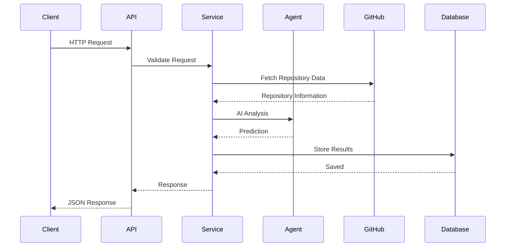
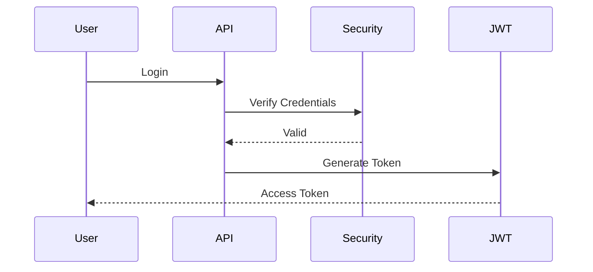

# Second Commit - Backend

> FastAPI backend powering **Second Commit**, an AI-driven platform that predicts the revival potential of abandoned software projects using GitHub data, Retrieval-Augmented Generation (RAG), and a Multi-Agent AI architecture.

---

# Tech Stack

| Technology | Purpose |
|------------|---------|
| FastAPI | REST API Framework |
| Python | Backend Language |
| Pydantic | Request & Response Validation |
| JWT Authentication | Secure Authentication |
| Celery | Background Task Processing |
| Redis | Celery Broker & Caching |

---

# Architecture

```mermaid
flowchart LR

Client

-->

FastAPI

FastAPI --> Authentication

FastAPI --> API Layer

API Layer --> Business Logic

Business Logic --> AI Agents

Business Logic --> GitHub Services

Business Logic --> RAG

Business Logic --> Database

AI Agents --> LLM
```

---

# Backend Structure

```
app/

├── api/
│   ├── auth/
│   ├── ideas/
│   ├── repositories/
│   ├── analysis/
│   ├── contributors/
│   ├── outreach/
│   └── freelancer/
│
├── core/
│   ├── config.py
│   ├── security.py
│   └── database.py
│
├── db/
│   ├── models/
│   ├── schemas/
│   └── migrations/
│
├── services/
│   ├── github/
│   ├── llm/
│   ├── rag/
│   ├── analysis/
│   └── contributor/
│
├── agents/
│   ├── idea_refiner.py
│   ├── repo_search.py
│   ├── repo_analyzer.py
│   ├── revival_predictor.py
│   ├── capability_estimator.py
│   ├── role_identifier.py
│   ├── contributor_matcher.py
│   └── outreach_generator.py
│
├── repositories/
│
├── utils/
│
└── main.py
```

---

# Request Lifecycle



---

# API Modules

## Authentication

Responsible for:

- User Registration
- User Login
- JWT Token Generation
- Protected Routes

### Endpoints

| Method | Endpoint | Description |
|---------|----------|-------------|
| POST | `/auth/register` | Register User |
| POST | `/auth/login` | Login User |

---

## Startup Ideas

Handles startup ideas submitted by founders.

### Endpoints

| Method | Endpoint |
|---------|----------|
| POST | `/ideas` |
| GET | `/ideas` |
| GET | `/ideas/{id}` |
| PATCH | `/ideas/{id}` |
| DELETE | `/ideas/{id}` |
| POST | `/ideas/{id}/refine` |
| POST | `/ideas/{id}/approve` |

---

## Repository Module

Searches GitHub repositories.

### Endpoints

| Method | Endpoint |
|---------|----------|
| POST | `/repositories/search` |
| POST | `/repositories/select` |

---

## Analysis Module

Runs AI analysis.

### Endpoints

| Method | Endpoint |
|---------|----------|
| POST | `/analysis/run` |
| GET | `/analysis/{id}` |

---

## Contributor Module

Finds suitable contributors.

### Endpoints

| Method | Endpoint |
|---------|----------|
| POST | `/contributors/recommend` |

---

## Outreach Module

Generates AI outreach.

### Endpoints

| Method | Endpoint |
|---------|----------|
| POST | `/outreach/generate` |

---

## Freelancer Module

Handles freelancer profiles.

### Endpoints

| Method | Endpoint |
|---------|----------|
| GET | `/profile` |
| PATCH | `/profile` |
| POST | `/github/connect` |
| POST | `/profile/analyze` |
| GET | `/projects/recommended` |
| POST | `/projects/{id}/accept` |
| POST | `/projects/{id}/decline` |

---

## Admin Module

Platform administration.

### Endpoints

| Method | Endpoint |
|---------|----------|
| GET | `/admin/dashboard` |
| GET | `/admin/users` |
| PATCH | `/admin/users/{id}` |
| DELETE | `/admin/users/{id}` |
| GET | `/admin/ideas` |
| DELETE | `/admin/ideas/{id}` |
| GET | `/admin/analytics` |

---

# Backend Flow

```mermaid
flowchart TD

Client

-->

Authentication

-->

Validate JWT

-->

API Route

-->

Business Service

-->

AI Agent

-->

GitHub API

-->

Database

-->

JSON Response
```

---

# AI Agent Architecture

```mermaid
flowchart TD

Idea

-->

Idea Refiner

-->

Repository Search

-->

Repository Analyzer

-->

Revival Predictor

-->

Capability Estimator

-->

Role Identifier

-->

Contributor Matcher

-->

Outreach Generator

-->

Final Report
```

---

# AI Agents

## Idea Refiner

Responsible for:

- Improving startup ideas
- Clarifying requirements
- Generating implementation-ready descriptions

---

## Repository Search Agent

Responsible for:

- Searching GitHub
- Ranking repositories
- Finding similar projects

---

## Repository Analyzer

Responsible for:

- Repository health
- Documentation quality
- Commit activity
- Issue analysis

---

## Revival Predictor

Responsible for:

- Revival score prediction
- Success probability
- Feasibility estimation

---

## Capability Estimator

Responsible for:

- AI vs Human contribution estimation
- Automation opportunities

---

## Role Identifier

Responsible for:

- Required roles
- Required skills
- Team estimation

---

## Contributor Matcher

Responsible for:

- Matching contributors
- Ranking candidates
- Skill compatibility

---

## Outreach Generator

Responsible for:

- Invitation messages
- Personalized emails
- Follow-up generation

---

# Service Layer

```
GitHub Service
│
├── Repository Search
├── Repository Metadata
├── Contributors
├── Commits
├── Pull Requests
└── Issues

LLM Service
│
├── Prompt Templates
├── AI Generation
└── Response Parsing

RAG Service
│
├── Embedding Creation
├── Vector Retrieval
└── Context Injection

Analysis Service
│
├── Repository Health
├── Trend Prediction
└── Revival Prediction

Contributor Service
│
├── Skill Matching
├── Ranking
└── Recommendations
```

---

# Background Tasks

Celery workers process long-running operations.

Examples:

- GitHub repository crawling
- AI analysis
- Embedding generation
- Contributor ranking
- Report generation
- Outreach generation

```mermaid
flowchart LR

API

-->

Redis Queue

-->

Celery Worker

-->

AI Processing

-->

Database
```

---

# Authentication Flow



---

# Error Handling

Standard API response format

```json
{
  "success": false,
  "message": "Repository not found",
  "error_code": "REPOSITORY_NOT_FOUND"
}
```

---

# Running the Backend

## Install Dependencies

```bash
pip install -r requirements.txt
```

## Start Redis

```bash
redis-server
```

## Start Celery

```bash
celery -A app worker --loglevel=info
```

## Run FastAPI

```bash
uvicorn app.main:app --reload
```

---

# Future Improvements

- Docker support
- Kubernetes deployment
- WebSocket notifications
- OAuth with GitHub
- API rate limiting
- Background scheduling
- Distributed Celery workers
- Monitoring with Prometheus & Grafana
- Automated testing
- CI/CD pipeline
