# Second Commit

> AI-powered Predictive Intelligence Engine for reviving abandoned software projects.

# Team Information

| Field | Details |
|---|---|
| Team Name | Commit2.0 |
| Team Leader | Akshara Dixit |
| Team Leader Email | dixitakshara96@gmail.com |
| Team Leader Phone Number | 9682729612 |
| Team Size | 3 |

## Problem Statement
**Predictive Intelligence Engine** – Develop a system that predicts future trends using historical and real-time data.

# Project Title
## Second Commit

## Project Description
Second Commit predicts the revival potential of abandoned GitHub repositories using historical repository data, real-time developer activity, Retrieval-Augmented Generation (RAG), and a CrewAI multi-agent system. It helps founders discover reusable software projects, estimate feasibility, identify contributors, and generate explainable revival plans.

## Features
- Repository revival prediction
- GitHub repository search
- Multi-agent AI analysis
- RAG-powered reports
- Contributor recommendation
- AI-generated outreach
- Explainable predictions
- Startup, Freelancer & Admin dashboards

# Overall Architecture

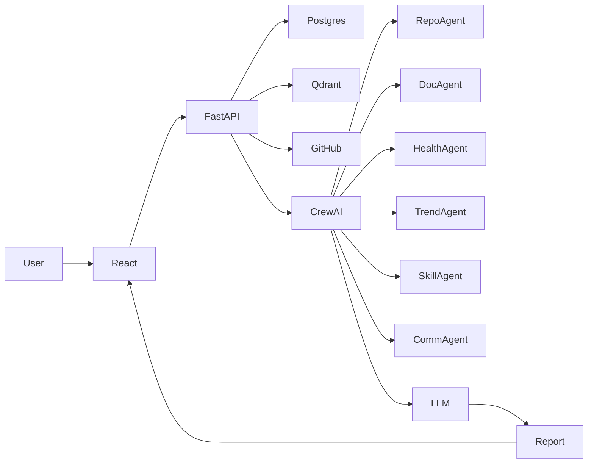

# Complete Platform Flow

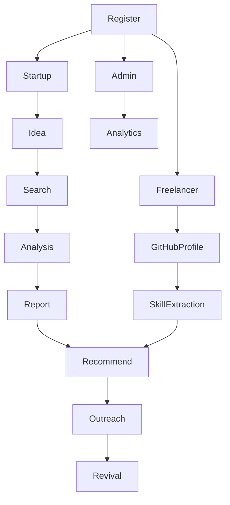

# Startup Owner Flow

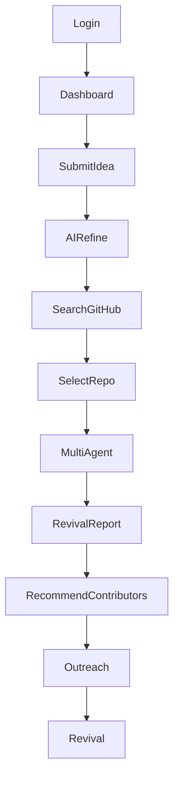

# Freelancer Flow

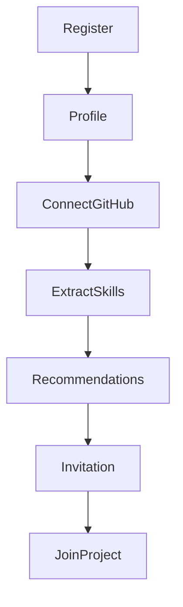

# Admin Flow

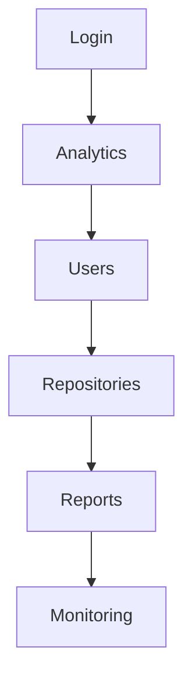

# Backend

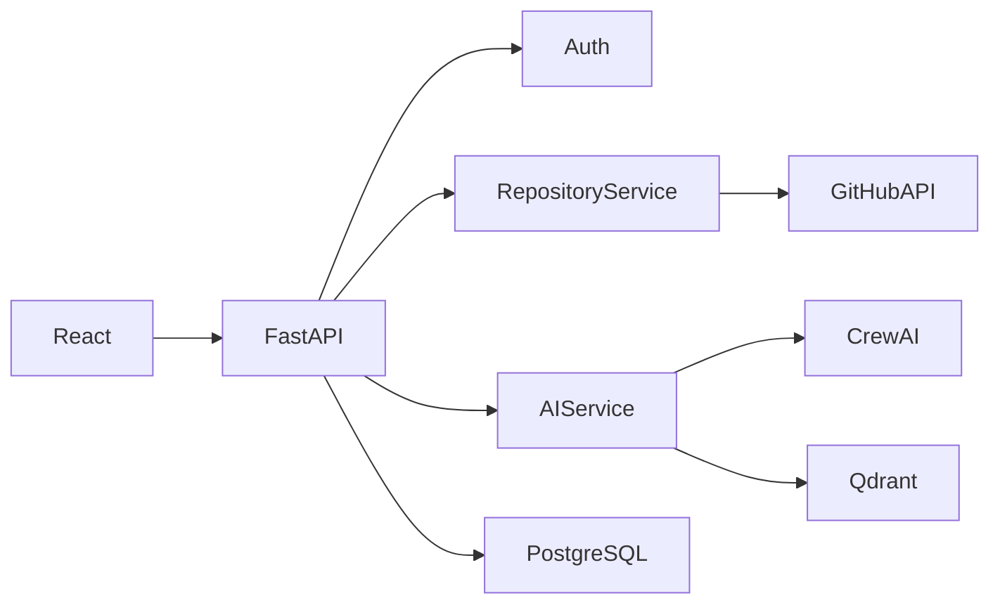

# Multi-Agent Pipeline

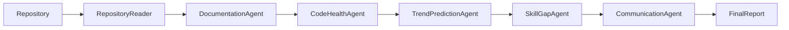

# AI Modules

## Repository Reader
- Reads commits, README, issues and pull requests.
- Creates repository summary.

## Documentation Agent
- Scores documentation quality.
- Detects missing documentation.

## Code Health Agent
- Measures repository health.
- Estimates maintenance effort.

## Trend Prediction Agent
- Predicts future technology relevance.
- Detects ecosystem trends.

## Skill Gap Agent
- Finds missing skills.
- Matches contributors.

## Communication Agent
- Generates outreach emails.
- Personalizes invitations.

# RAG Pipeline

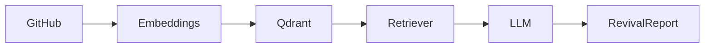

# Explainable AI

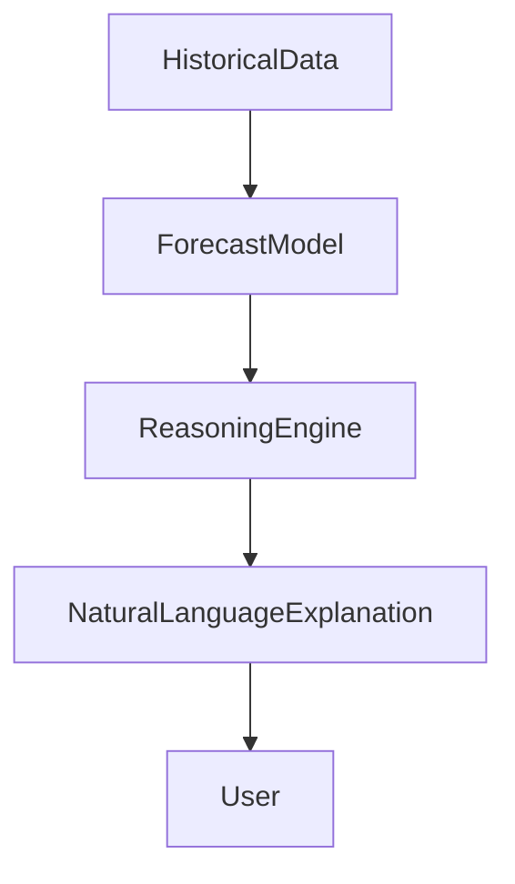

# Database ER Diagram

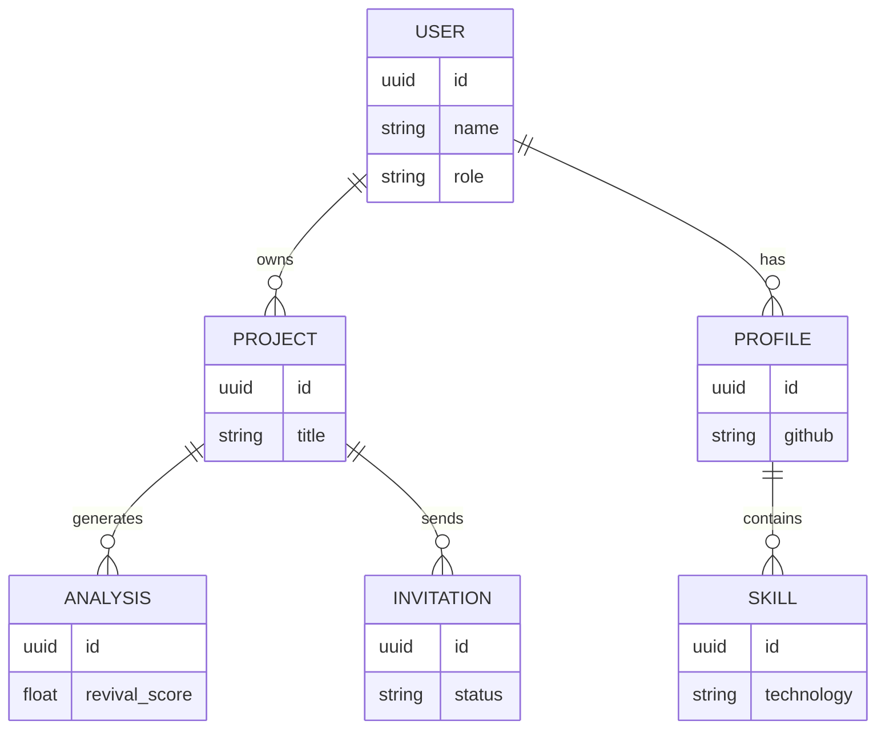

# Sequence Diagram

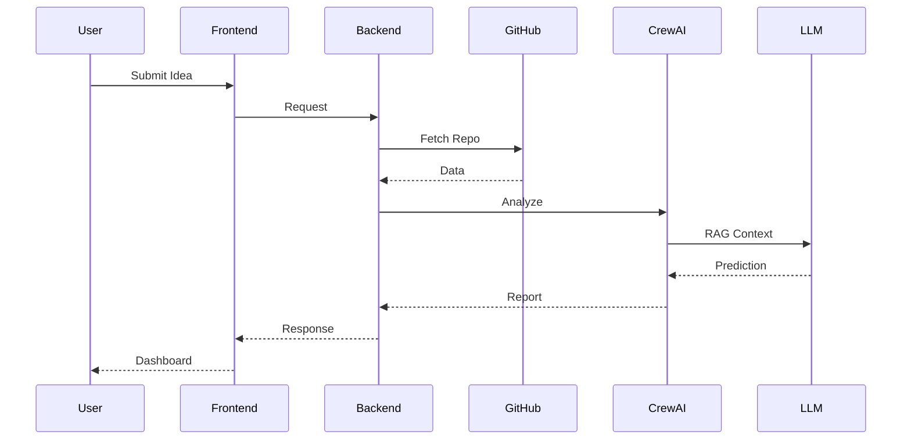

# Tech Stack

## Frontend
- React
- Vite
- Tailwind CSS
- shadcn/ui
- Framer Motion

## Backend
- FastAPI
- Python
- Celery
- Redis
- JWT
- Pydantic

## Database
- PostgreSQL
- Qdrant

## AI
- CrewAI
- LangChain
- Sentence Transformers
- HuggingFace
- Zephyr
- Mistral
- DeepSeek
- RAG

## APIs
- GitHub REST API
- GitHub Search API
- GitHub Commits API
- GitHub Contributors API
- GitHub Issues API
- GitHub Topics API

# Folder Structure

```text
frontend/
backend/
agents/
rag/
database/
docs/
```

# Installation

```bash
git clone <repo>
cd second-commit
pip install -r requirements.txt
npm install
npm run dev
uvicorn app:app --reload
```

# Team Members

| Name | Role |
|---|---|
| Akshara Dixit | AI/ML |
| Kriti Jain | Backend |
| Jahnvi Katiyar | Frontend |

# Prototype
Add link

# PPT
Add Google Drive link

# Video Demo
Add Google Drive link

# Future Scope
- Continuous monitoring
- CI/CD integration
- PR automation
- Slack/Discord integration
- Funding prediction
- Organization-wide analytics

